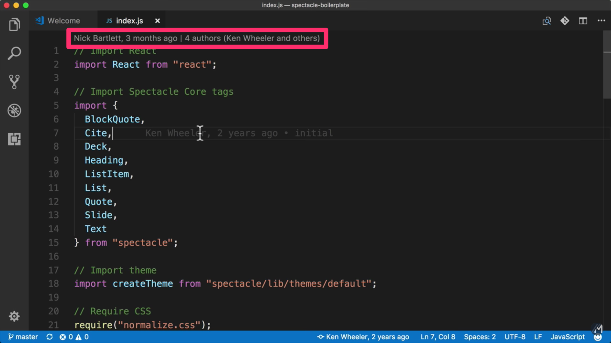
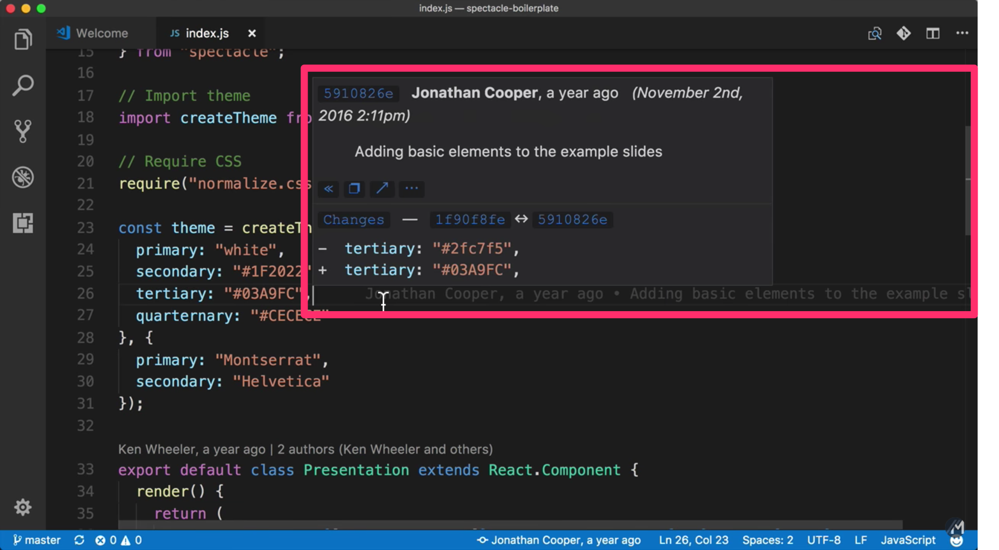
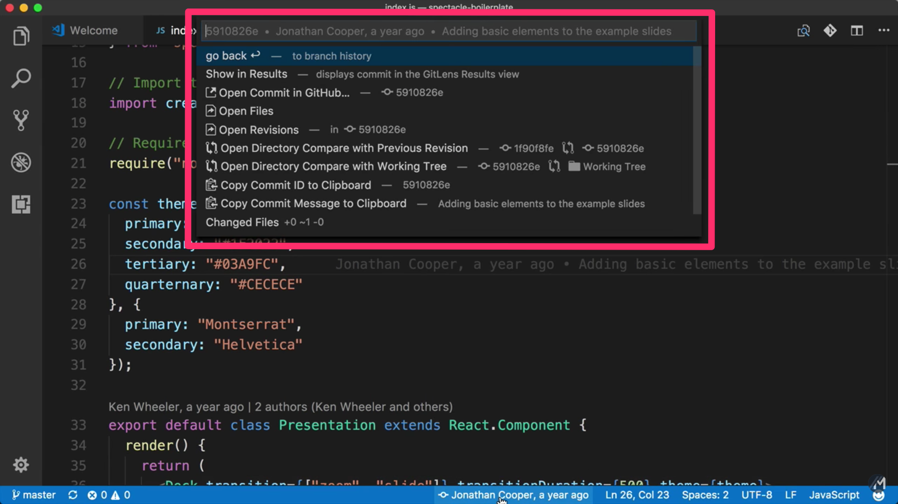
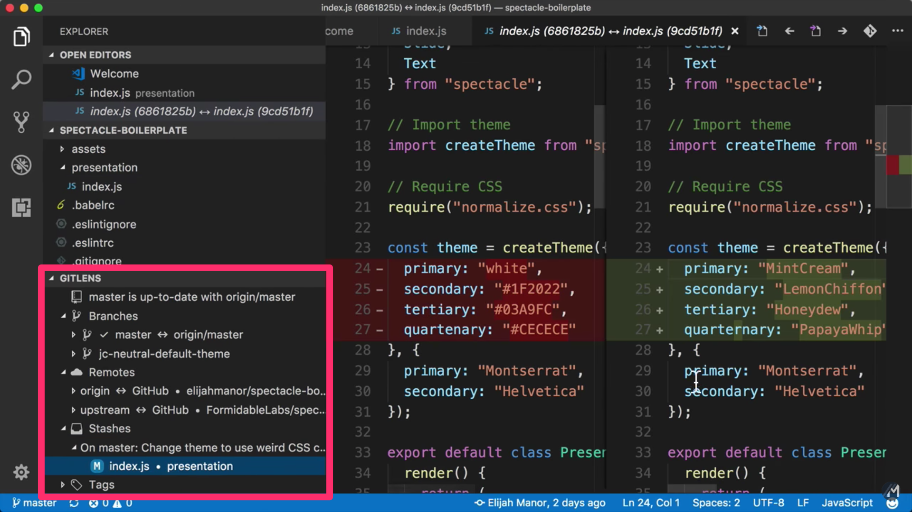
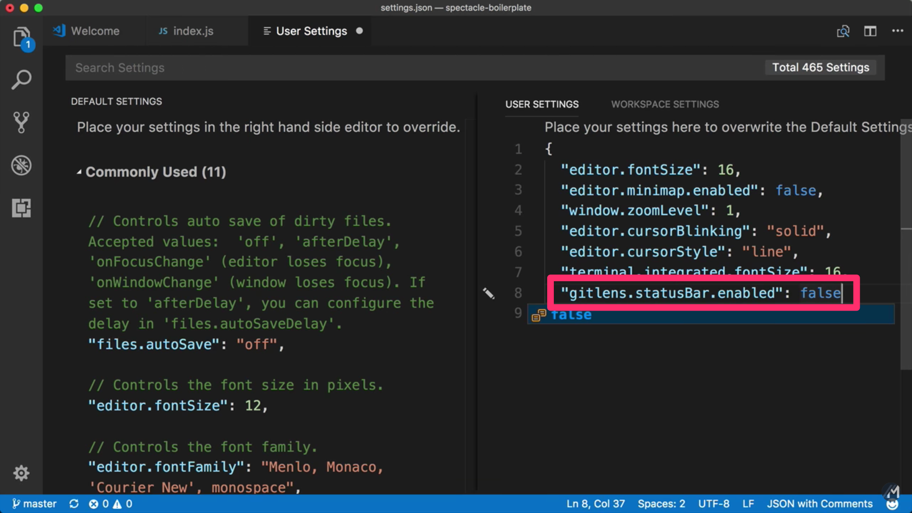



In the above video I look at the [Git Lens](https://marketplace.visualstudio.com/items?itemName=eamodio.gitlens) VSCode Extension. If you use [VSCode](https://code.visualstudio.com/) and [git](https://git-scm.com/) as your "version control system" in any of your personal or work projects, then I think you are going to like this!

## File Stats



## Line Stats



## File Commands



## Side Panel Options



## Override User Settings



```js
if ( true ) { console.log(    "this is" ) }
```
