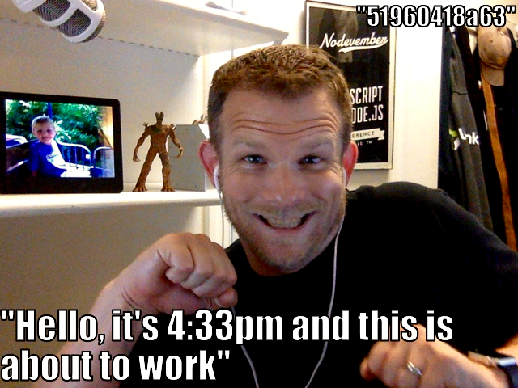
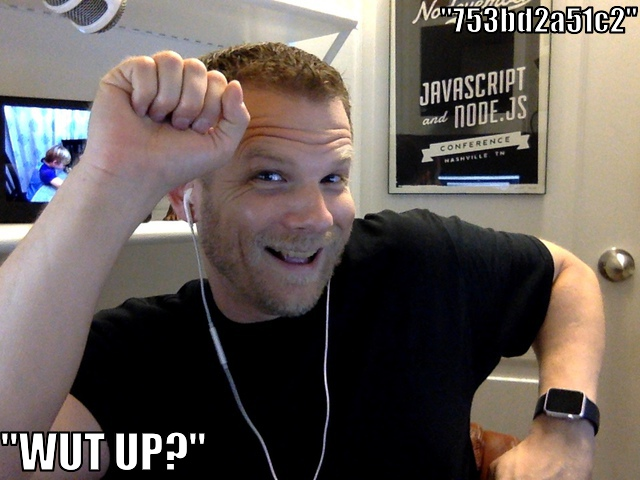

{:.full-img}

Sometimes `git` commit messages can get pretty boring. Wouldn't it be great if
we could spice them up just a little? Well, that is where `lolcommits` comes
into play. What if we could combine selfies with `git` commits? Sounds like a
match made in heaven!

📷 git-based selfies for software developers https://lolcommits.github.io

https://github.com/mroth/lolcommits

	

		
	

	

		
	

{:.full-img}

<!--
http://resizeimage.net/
-->
