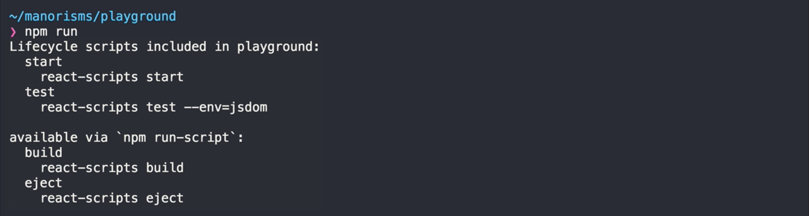



<div class="g-ytsubscribe" data-channelid="UCSUkyvHHdLuFKkHyYxCmmcw" data-layout="default" data-count="default"></div>

[`create-react-app`](https://github.com/facebook/create-react-app) is a handy CLI tool which allows you to quickly create and run a React application with no configuration. In this post (and the above video) I'll show how to get started with `create-react-app` and long the way, we’ll look at each of its built-in scripts and also investigate various ways to keep your `react-scripts` dependency up-to-date.

<!--more-->

## Installation

First, you'll need to verify what version of `node` and `npm` you have installed. You can do this on the command line by typing...

```bash
node -v && npm -v
```

You need at least Node version 6 or above on your dev machine in order for `create-react-app` to work. If you are using `npm` version `5.2` or above you can utilize the [`npx`](https://medium.com/@maybekatz/introducing-npx-an-npm-package-runner-55f7d4bd282b) package runner instead of having to install `create-react-app` globally.

To create your React app you can run...

```bash
npx create-react-app playground
```

That’ll create a new playground React app and start to install all the dependencies that it needs to run, build. etc…


## Native `npm` Scripts

Once the app creation has completed and it's dependencies have finished installing, you can change directories to your new project and execute `npm run` in order to see all the scripts that are available.

```
cd playground
npm run
```

You should see `start`, `test`, `build`, and `ejects` scripts listed in your terminal. We will go through these scripts and show you what they do.



### `start` Script

```
npm start
```

The `start` script will kick off a development server for your app and launch a browser instance to the correct URL.


The folder structure of the generated app is pretty straightforward. Most files can be found in the `src` folder. The `index.js` file is where our App begins. You can see the `ReactDOM.render` where it attaches to the `root` DOM element. The `App.js` file contains the `App` React component where the main header and intro text can be found.

The `package.json` file, in particular, is a sight for sore eyes. Where are all the dependencies!?! There are only 3 depedencies: `react`, `react-dom`, and `react-scripts`. The `react-scripts` dependency manages all of the other dependencies such as `babel`, `webpack`, `jest', etc...

Even the `npm` scripts are just thin proxies to functionality inside of `react-scripts`.

### `test` Script

```
npm test
```

Under the covers React uses the Jest test runner, which is a really nice tool.

Out of the box, the generated app only has one unit tests, but you are highly encouraged to write your own tests once you start building out your app.


### `build` Script

```
npm run build
```

The `build` script will create a production build of your app and output the results to the `build` folder.

Once the build is complete, you can go into the build folder (`cd build`) and kick up a simple http server with `npx serve` 

```
cd build && npx serve
```

At that point, you can head over to your browser and take a look at a built version of your react app.


### `eject` Script

```
npm run eject
```

If the application that was generated by `create-react-app` doesn’t quite fit your needs (babel config, webpack config, etc…) then you can use the `eject` script, which will export all of your app's dependencies, configurations, and scripts and inject them into your app.

This is permanent. There will no longer be a quick and easy way to upgrade your app if Facebook makes a new version of `react-scripts`. 

Once you eject you'll see a new `config` folder that contains stuff for jest, polyfils, and various webpack configurations. 

Also, you'll have a `scripts` folder that contains code for your `build`, `start`, and `test` scripts. 

In addition, the `package.json` file is MUCH larger than it used to be. You’ll notice that there are many dependencies that could possibly use updating. The `react-scripts` dependency used to take responsibility of keeping the dependencies up-to-date and compatible, but now that is your responsibility. 


### Various Ways to Update `react-scripts`

As your app gets older, newer version of `react-scripts` may come out. These newer versions may come with bug fixes or new features that you may want to leverage.

1. Using Native VSCode

	If you have an older version of `react-scripts`, then you can open up the `package.json` file and hover over your dependency to see what the latest version of that dependency is! Cool, right?

	

2. Using VSCode Extension

	If you do use VSCode, you could go one step further and install an extension called [Version Lens](https://marketplace.visualstudio.com/items?itemName=pflannery.vscode-versionlens). Once installed this extension adds metadata to your package.json dependencies. The extension will indicate if you are using the latest version, what version it'll update based on the range you specified, and also show the latest version published in `npm`. You can also click on the metadata links to update your `package.json` file with the new version.

	

3. Using `npm view`

	First let’s run `npm view react-scripts versions` this will list out all of the versions that have been published to npm.

	If you want just the latest official release you can try the same command, but remove the `s` at the end.

	

4. Using `npm outdated`

	Another command you can try is `npm outdated`, which is a native npm command. It’ll check the registry for you and see if you have any packages that are currently outdated. 

	The output will list the current version installed, the highest version based on your supplied version range, and the latest version that has been published. This is a great command, however, it is read-only.

	

5. Using `npm-check`

	If you want a more interactive update tool, you can try out [`npm-check`](https://www.npmjs.com/package/npm-check) with the `-u` (interactive update) flag.

	The output is an interactive list of dependencies that need updating. You can navigate through the list and select one or more with the space bar and then enter to install.

	

## Conclusion

<div class="g-ytsubscribe" data-channelid="UCSUkyvHHdLuFKkHyYxCmmcw" data-layout="default" data-count="default"></div>
I hope you found something helpful from this post. The above video is the first in a series about `create-react-app`, so stay tuned. You may also want to subscribe to the [Manorisms YouTube Channel](https://www.youtube.com/manorisms) to make sure you are notified when new material is posted. 

> This is the first post in a series about `create-react-app`. The next post in the series is [Debugging a Create React App with VS Code](/cra-debug-vscode).
