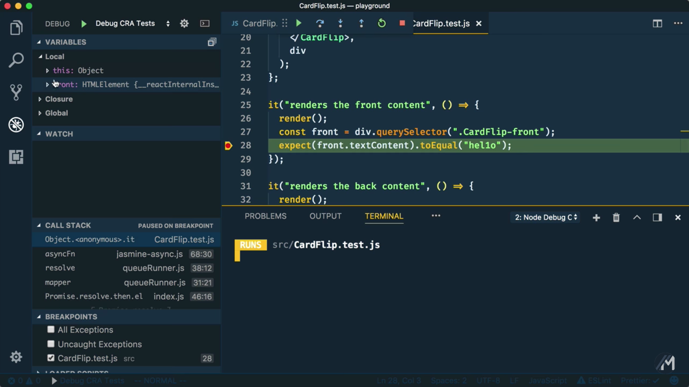



<div class="g-ytsubscribe" data-channelid="UCSUkyvHHdLuFKkHyYxCmmcw" data-layout="default" data-count="default"></div>

In this post (and the above 4 minute embedded video) we’ll look at how to configure [Visual Studio Code](https://code.visualstudio.com/) to debug [React](https://reactjs.org/) Components and [Jest](https://facebook.github.io/jest/) Unit Tests inside a web application that was created by [`create-react-app`](https://github.com/facebook/create-react-app).

<!--more-->

> This is the second post in a series about `create-react-app`. You can start the series with [Getting Started with Create React App](/cra-getting-started).

## Sample Web Application


On the left, we have a simple `playground` web application that was previously created with `create-react-app`.

We can easily kick up a development web server by typing `npm start` in the terminal. `react-scripts` will create a new browser tab to the correct URL and port (e.g. `http://localhost:3000`).


However, our React web application has a bug. If I click on the joke, the answer does not display.

## Debugging React Components

By looking at the following code, it may not be obvious what is causing the bug. Wouldn’t it be great if we could debug this code right inside of Visual Studio Code? Well, we can!


1. **Chrome Debugger**

	Before we can start debugging, you need to make sure we have the [`Debugger for Chrome`](https://marketplace.visualstudio.com/items?itemName=msjsdiag.debugger-for-chrome) extension installed and reloaded.

	

2. **Making Breakpoints**

	Now, we can start making some breakpoints right were we would like to investigate your code.

	

3. **Chrome Launch Configuration**

	Next, from the debug panel you need to configure the launch script for chrome.  If you don’t have any existing scripts, then you can just select one like “chrome” for example from the gear icon. It doesn’t really matter, as we are going to clear out the contents and replace it anyway. 

	Let’s go to the official `create-react-app` [documentation](http://bit.ly/manorisms-cra-debug-vscode-react) and grab the launch configuration to debug your web application. Just copy the whole snippet, and paste it in your `launch.json` file.

	

	> NOTE: The following snippet may change as `create-react-app` evolves. Please refer to the official [documentation](http://bit.ly/manorisms-cra-debug-vscode-react) for the latest configuration snippet.

	```json
{
  "version": "0.2.0",
  "configurations": [{
    "name": "Chrome",
    "type": "chrome",
    "request": "launch",
    "url": "http://localhost:3000",
    "webRoot": "${workspaceRoot}/src",
    "sourceMapPathOverrides": {
      "webpack:///src/*": "${webRoot}/*"
    }
  }]
}
	```

4. **Launch Chrome Debugger**

	And now, we are ready to debug our web app. Go up to the green arrow and make sure “Chrome” is selected in the dropdown, then click the green arrow.

	This will kick up yet another browser instance, one that is connected to VS Code’s debugger. At this point, you’ll probably need to refresh your browser to initiate your breakpoint.  

	Soon we'll reach our first breakpoint inside of VS Code!

	

	From here, you have access to look around at your local variables in the left panel. There are options to add watches, browse the call stack, etc… There is also a handy interactive Debug Console. For example, you can change the value of isFlipped to `true` to simulate that we actually clicked the joke.

	You can step over the breakpoint and hover over the `classes` variable to inspect it’s value at this point in time. For our bug, the problem is that the `CardFlip-flipped` className should have two dashes and not just one (as its using the SUIT CSS naming convention to indicate it’s a modifier). Thankfully, that’s easy to fix by adding an extra dash.

	Now, we can stop the debugger and retry our web app and sure enough, it works just fine!

	

## Debugging Unit Tests

Now that we have our web application code all fixed up, let’s move to debugging our Jest unit tests. 

1. **Debug CRA Tests Launch Configuration**

	Here we have some code testing the behavior of our `CardFlip` React component.

	

	However, if we come to the terminal and run our Jest tests you’ll notice that one of them is failing at the moment. Let’s go inside and add a breakpoint to debug our code. 

	Unfortunately, our previous launch script will not help us in this situation, but we can also go out to the official [documentation](http://bit.ly/manorisms-cra-debug-vscode-jest) to find the snippet we need. From the documentation you can copy the configuration section, add it to the array that you already have in your `launch.json`, and save the file.

	

	> NOTE: The following snippet may change as `create-react-app` evolves. Please refer to the official [documentation](http://bit.ly/manorisms-cra-debug-vscode-jest) for the latest configuration snippet.

	```json
{
  "version": "0.2.0",
  "configurations": [
    {
      "name": "Debug CRA Tests",
      "type": "node",
      "request": "launch",
      "runtimeExecutable": "${workspaceRoot}/node_modules/.bin/react-scripts",      
      "args": [
        "test",
        "--runInBand",
        "--no-cache",
        "--env=jsdom"
      ],
      "cwd": "${workspaceRoot}",
      "protocol": "inspector",
      "console": "integratedTerminal",
      "internalConsoleOptions": "neverOpen"
    }
  ]
}
	```

2. **Launch Debug CRA Tests Debugger**

	Now, switch the option in the dropdown to “Debug CRA Test” and click the green arrow. This will kick off Jest and then VS Code will stop at our breakpoint.

	

	Like before, we could look at the local variables panel, but we will come down to the debug console and inspect the DOM element’s text context. Ohhhh, hello has a `1` instead of an `l` in it. Let’s fix that, save, and rerun our tests. Yup, that was it. Our tests are all green now. 

	

## Conclusion

<div class="g-ytsubscribe" data-channelid="UCSUkyvHHdLuFKkHyYxCmmcw" data-layout="default" data-count="default"></div>
Thanks for reading this second post in the `create-react-app` series. The above video is the first in a series, so stay tuned. You may also want to subscribe to the [Manorisms YouTube Channel](https://www.youtube.com/manorisms) to make sure you are notified when new material is posted.
