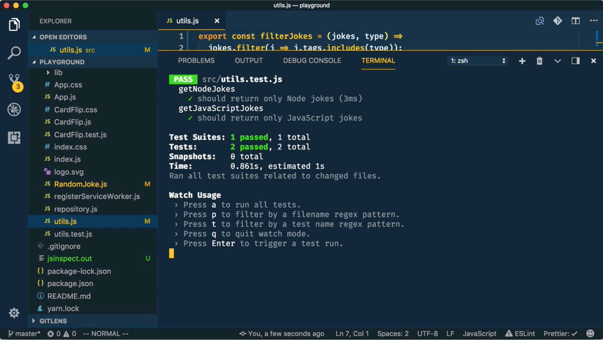
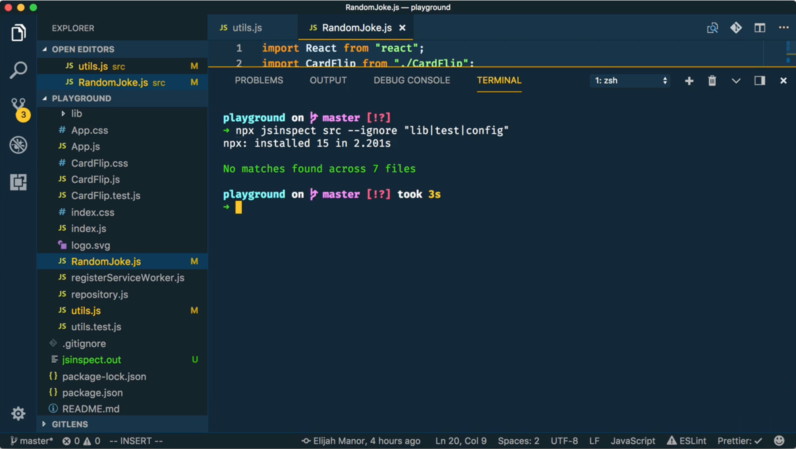

<div id="youtube-embed"></div>


<div class="g-ytsubscribe" data-channelid="UCSUkyvHHdLuFKkHyYxCmmcw" data-layout="default" data-count="default"></div>

In this post (and the above 5 minute embedded video) we’ll look at how to detect copy and pasted code inside of your web application using two different node command-line tools.

<!--more-->

## `jsinspect`

The first tool we are going to use is a node command-line tool called [`jsinspect`](https://github.com/danielstjules/jsinspect) which understands ES6, JSX, and Flow. There are quite a few CLI options to choose from, but thankfully it’s pretty easy to get started.


### Detect Copy-Paste JavaScript

In the screenshot below I'm using the integrated terminal inside of [Visual Studio Code](https://code.visualstudio.com/). I'm using the [`npx`](https://medium.com/@maybekatz/introducing-npx-an-npm-package-runner-55f7d4bd282b) package runner (that comes with `npm@5.2.0`) to execute the `jsinspect` tool against our JavaScript code found in the `src` folder.


```shell
# detect copy-paste code in src folder
npx jsinspect src
```

### Ignore Paths

If the results of the above command returns more than you bargain for, then you can pass the `--ignore` CLI option and tell `jsinspect` to ignore one or more paths. The following command ignores the `lib`, `test`, and `config` folders.


```shell
# ignore the lib, test, and config folders
npx jsinspect src --ignore "lib|test|config"
```

### Adjust Thresholds

Another feature `jsinspect` has is to control the threshold (the number of nodes) it uses to determine if a section of code is structurally similar to another. The default threshold is 30, but you can tweak the value by using the `--threshold` CLI option.

```shell
# a lower threshold should yield more matches
npx jsinspect src --ignore "lib|test|config" --threshold 10

# a higher threshold should yield less matches
npx jsinspect src --ignore "lib|test|config" --threshold 40
```

### Fix the Duplication

Now, let’s change our focus to actually fixing our copy-paste issues starting in `utils.js`.  You can probably spot pretty quickly the section of code that is duplicated. Yes, this is completely contrived, so bear with me.

```js
export function getNodeJokes(list) {
  const jokes = [];
  for (let i = 0; i < list.length; ++i) {
    const joke = list[i];
    if (joke.tags.indexOf("node") !== -1) {
      jokes.push(joke);
    }
  }
  return jokes;
}

export function getJavaScriptJokes(list) {
  const jokes = [];
  for (let i = 0; i < list.length; ++i) {
    const joke = list[i];
    if (joke.tags.indexOf("javascript") !== -1) {
      jokes.push(joke);
    }
  }
  return jokes;
}
```

<!--  -->

Instead of just taking the code and wrapping it in a function call, this could be an opportunity to rewrite the code to use newer JavaScript features. In this case, we'll use ES5 and ES6 features. 

```js
export const filterJokes = (jokes, type) =>
  jokes.filter(j => j.tags.includes(type));

export const getNodeJokes = list => filterJokes(list, "node");

export const getJavaScriptJokes = list =>
  filterJokes(list, "javascript");
```

> NOTE: I don't show refactoring the `RandomJokes.js` file in this post. However, if you'd like to see the refactor then feel free to watch the [embedded video](#youtube-embed) at the top of this blog post.

### Verify Duplication is Gone and Unit Tests Pass

Before we proceed, we should probably verify that all of our unit tests still pass. In our terminal we can run `npm test` to execute our [Jest](https://facebook.github.io/jest/) tests.



In addition, we should probably also re-run `jsinspect` to show that we’ve address all of the copy-paste violations at the default threshold… and sure enough, we did.



Now, we can kick up our development web server and watch our app work. And yes, here are some glorious react puns. oh yeah.


## `jscpd`

The other tool that can be verify handy detecting Copy-Paste is the [`jscpd`](https://github.com/kucherenko/jscpd) command-line tool. The neat thing about this one is that it supports a wide variety of programming languages.


The CLI options are slightly different than `jsinspect`, but it’s also pretty easy to get started. We’ll using `-f` to indicate which files to include in our detection… in our case, we’ll recursively look for JavaScript files. And we’ll `-e` exclude any files in the `lib` folder. Like `jsinspect` we can also control the threshold with the `-t` option, which stands for the minimum number of tokens to use when determining duplication.


```shell
# search js files, exclude lib folder, tokens at 30
npx jscpd -f "src/**/*.js" -e "**/lib/**" -t 30

# exclude multiple folders and adjust tokens to 10
npx jscpd -f "src/**/*.js" -e "**/+(lib|test)/**" -t 10
```

### Detect Copy-Paste in CSS Files

However, as we stated earlier, one of the really cool things about `jscpd` is that it understands multiple computer languages. So, we could, for example, switch our detection to search CSS files instead of JavaScript. As you can see in the following screenshot, it found some duplication between our `App.css` and `CardFilp.css` files.


```shell
# changes files to search for css copy-paste
npx jscpd -f "src/**/*.css" -e "**/+(lib|test)/**" -t 10
```

## Conclusion

<div class="g-ytsubscribe" data-channelid="UCSUkyvHHdLuFKkHyYxCmmcw" data-layout="default" data-count="default"></div>
Thanks for reading this post and/or watching the above embedded video. I hope you find the `jsinspect` and `jscpd` tools helpful in your projects. You may also want to subscribe to the [Manorisms YouTube Channel](https://www.youtube.com/manorisms) to make sure you are notified when new material is posted.
