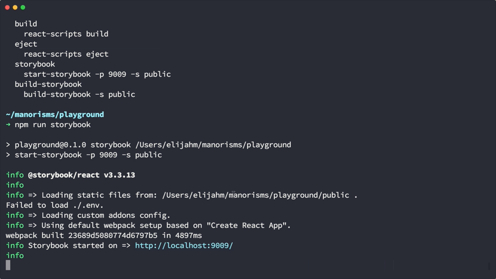



<div class="g-ytsubscribe" data-channelid="UCSUkyvHHdLuFKkHyYxCmmcw" data-layout="default" data-count="default"></div>

In this post (and the above 6 minute embedded video) we’ll look at how to add the [Storybook](https://storybook.js.org/) style guide to a [React](https://reactjs.org/) web app boostrapped by [`create-react-app`](https://github.com/facebook/create-react-app).

<!--more-->

> This is the third post in a series about `create-react-app`.
> 1. [Getting Started with Create React App](/cra-getting-started)
> 2. [Debugging a Create React App with VS Code](/cra-debug-vscode)

## Installing Storybook


Let's quickly bootstrap a web app with `create-react-app`. From the command line we'll use `npx` to kick off `create-react-app` and name our project `playground`. `create-react-app` will then generate our app and proceed to install all its necessary node dependencies. Once that's done, we'll change directories to our new app and proceed to install `storybook` into the app by typing `npx storybook`. At this point, storybook detects the type of app, notices that it was bootstraped by `create-react-app`, and then proceeds to install its necessary dependencies.

```shell
➜ npx create-react-app playground-storybook
➜ cd playground-storybook
➜ npx storybook
```

## Investigating Generated Storybook Files


Once storybook has finished, we can open up [VS Code](https://code.visualstudio.com/) and check out what has changed. You can notice a hidden folder called `.storybook` that contains 2 files.

### `.storybook/addons.js`

```javascript
import '@storybook/addon-actions/register';
import '@storybook/addon-links/register';
```

The `addons.js` file imports any addons that you might need. In this case, it's importing the `actions` and `links` addons. We will look at how those are used in another file.

### `.storybook/config.js`

Next, we have the `config.js` file. This is where we tell `storybook` where to find our story definitions, in this case they are in the `../src/stories` folder.

```javascript
import { configure } from '@storybook/react';

function loadStories() {
  require('../src/stories');
}

configure(loadStories, module);
```

### `src/stories/index.js`

Now, let's take a look at the `index.js` file that `storybook` created in our `src/stories` folder. At the top, we `import` several items from `storybook` and our related addons.

```javascript
import React from "react";

import { storiesOf } from "@storybook/react";
import { action } from "@storybook/addon-actions";
import { linkTo } from "@storybook/addon-links";

import { Button, Welcome } from "@storybook/react/demo";
import App from "../App";

storiesOf("Welcome", module).add("to Storybook", () => (
  <Welcome showApp={linkTo("Button")} />
));

storiesOf("Button", module)
  .add("with text", () => (
    <Button onClick={action("clicked")}>
      Hello Button
    </Button>
  ))
  .add("with some emoji", () => (
    <Button onClick={action("clicked")}>😀 😎 👍 💯</Button>
  ));
```

We have stories for two main components listed in this file, `Welcome` and `Button`. Both of these are samples that came from the `storybook` repo to get you started.

In the `Button`'s case, there are two examples stories listed for the `Button` component.

The `linkTo` addon can redirect to other components (such as the `Button` listed here) and the `action` addon lets you log actions of a component to a custom panel (in our case `Button` clicks will be logged).

### `package.json`

Let's briefly switch gears to the `package.json` file before we kick up the web server. You'll notice that `storybook` added a couple of `npm scripts` for us to use. There is a `storybook` script that'll kick up a developer server and a `build-storybook` script that'll build a version of the style guide that you can host somewhere. As for dependencies, `storybook` added `storybook/react`, `storybook/addon-actions`, and `storybook/addon-links` to our `devDependencies`.

```diff
{
  "name": "playground",
  "version": "0.1.0",
  "private": true,
  "dependencies": {
    "react": "^16.2.0",
    "react-dom": "^16.2.0",
    "react-scripts": "1.1.1"
  },
  "scripts": {
    "start": "react-scripts start",
    "build": "react-scripts build",
    "test": "react-scripts test --env=jsdom",
    "eject": "react-scripts eject",
+   "storybook": "start-storybook -p 9009 -s public",
+   "build-storybook": "build-storybook -s public"
  },
  "devDependencies": {
+   "@storybook/react": "^3.3.13",
+   "@storybook/addon-actions": "^3.3.13",
+   "@storybook/addon-links": "^3.3.13"
  }
}
```

## Kicking up the Storybook Dev Server

Okay, let's move on to see what the style guide looks like. Back in our terminal we can type `npm run` to see all the scripts we have available, and as I mentioned earlier there is a `storybook` entry. So, to kick off a developer server we will execute `npm run storybook`. This will use [`webpack`](https://webpack.js.org/) to build your react app and then start a web server on port 9009.



And now, you can open up a browser to navigate the style guide. The welcome page has some summary information with helpful information to get started. As we noted earlier, the links addon should redirect us to the Button component when we click on the "stories" link. Also, as we saw before, when we click on the Button... we will see the event logged in the panel below as a result of the action addon. Here we have another story for Button that shows using emojis instead of text. If we click on the button, it'll also log it's action in the panel below.


## Adding a New Component Story

Now, let's try adding our own story to `storybook`. Seeing that we just created our React app, there aren't many components, however, there is the main `App` component that `create-react-app` generated, so let's use that.

We will start by importing App from the App compoennt. And then we'll copy the Welcome set of stories and rename it to "App" instead. Let's name our first story as "default" and instead of the Welcome component we will reander the `App` component.

### `src/stories/index.js`

```javascript
import App from "../App";

// ... more code ...

storiesOf("App", module)
  .add("default", () => <App />);
```

Now, when we come back to the browser we should see our new `App` component, and if we open it, we'll see our `App` rendered!


However, the `App` component doesn't support any customizable `props`, so let's fix that. We'll come back over to VS Code and edit our `App` component. Let's destructure the `title` prop from the component's `props` and use it to dynamically render the `title`, instead of always saying "Welcome to React". Before we move on we will give `title` a default value in case one is not passed to the component.

```diff
import React, { Component } from "react";
import logo from "./logo.svg";
import "./App.css";

class App extends Component {
  render() {
+   const { title } = this.props;
    return (
      <div className="App">
        <header className="App-header">
          
          <h1 className="App-title">Welcome to {title}</h1>
        </header>
        <p className="App-intro">
          To get started, edit <code>src/App.js</code> and
          save to reload.
        </p>
      </div>
    );
  }
}

+ App.defaultProps = {
+   title: "React"
+ };

export default App;
```

Now, we'll switch back over to our `src/stories/index.js` file and add another story to the `App` component. We'll call this one, "title" and pass it a title prop of "My World".

```diff
import App from "../App";

// ... more code ...

storiesOf("App", module)
  .add("default", () => <App />)
+ .add("with title", () => <App title="My World" />);
```

If we come back to the browse, we will see a new entry under the `App` component listing hte new "with title" story and it'll show "Welcome to My World".


At this point, the stories are pretty static, but there are ways you can make your stories much more interactive. However, we won't go into those in this blog post. If that interests you, please let me know on Twitter at [@elijahmanor](https://twitter.com/elijahmanor).

## Building Storybook and Serving Locally

Now, let's focus on building our style guide. We will cancel our dev server and type `npm run build-storybook` in the terminal. This will build a version of the style guide to a folder called `storybook-static`. Once it's done you can kick up a simple http server to run the web app. In our case running `npx serve storybook-static` will suffice. And now we can navigate to `localhost:5000` to see our static style guide. And sure enough, it works just great!

```shell
➜ npm run build-storybook
➜ npx serve storybook-static
```


## Conclusion

Thanks for reading this third post in the `create-react-app` series. If you don't already have a style guide solution, storybook is a nice and easy way to quickly get started building an interactive style guide. 
