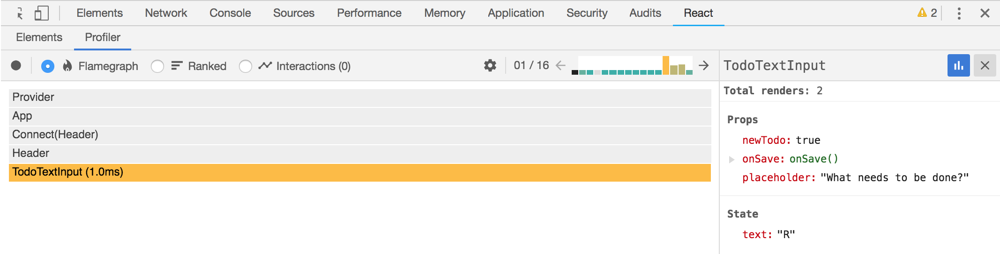



React version 16.5.0 has been released and one of the features that it supports is the new Profiler in the [React Developer Tools](https://github.com/facebook/react-devtools). In the above video and following blog post, we will update an existing app to ⚛ React 16.5.0 and show off various features of the new Profiler. The tool can record a lot of information from your React App, but you can also add interaction tracking to help track user generated events.

<!--more-->

## Installation

Before you can utilize the new Profiler feature of the React Developer Tools, you'll need two things...

1. [React v16.5.0+](https://www.npmjs.com/package/react) (Developer Build)
2. [React Developer Tools](https://github.com/facebook/react-devtools) v3.3.2+

> NOTE: If you want to profile in production see the [Profiling in Production](https://gist.github.com/bvaughn/25e6233aeb1b4f0cdb8d8366e54a3977) gist from Brian Vaughn ([@brian_d_vaughn](https://twitter.com/brian_d_vaughn)).

## Profiling Your Application

For testing purposes, I've grabbed the Redux TodoMVC Example app from the redux repository to play around with. You can find the code for this video/post at [github.com/elijahmanor/redux](https://github.com/elijahmanor/redux/tree/profiler/examples/todomvc)

### Empty Profiler Tab

Initially, the Profiler tab will look empty (see following screenshot). In order to assess the performance of your appplication, you'll need gather profiling data first. You can do this by clicking the ⏺ record button and then start interacting with portions of your application that you want to profile. Once you are satisfied with the data, then click the "Stop "button.


### Initial Flamegraph after Gathered Data

Once you've gathered profile data, you'll immediately seen Flamegraph data for the first render that occured (see following screenshot). For each render you can see what components were involved and which ones took the most time to complete. The gray items didn’t need to re-render at all (they could have been `PureComponents` or implemented `shouldComponentUpdate` manually).


### Single-Click to View a Component's Details

If you single-click on one of the components (like `TodoTextInput` for example) then the Flamegraph will zoom into that particular component tree (see following screenshot) and the right panel will give more detail about that component including its `props` and `state`.



### Double-Click to View a Comparison Across All Renders 

You can double-click on an item (like `MainSection` for example) and see a comparison graph of how long it took across all renders. And then you can drill into one of the instances by double-clicking on it to see which render that was related to. 


### Ranked Flat View of Components

You can also look at a ranked flat view of the components from top to bottom. The items at the top took the longest and items at the bottom took the least amount of time to render. This view can be helpful trying to make sense of all the data presented.


## Tracking User Interactions

There is another view called "Interactions", but it’ll probably be empty by default. You have to add some code to our app before anything will show up here.

The point of interactions is to give meaningful names to user events. The idea is to associate a render in the Profiler based on the intent of what happened. For example, it'd be nice if we could see the render when a Todo item is being added or when one is being completed. 

> There's a nice gist describing the ins-and-outs of  [Interaction Tracking with React](https://gist.github.com/bvaughn/8de925562903afd2e7a12554adcdda16) written by Brian Vaughn ([@brian_d_vaughn](https://twitter.com/brian_d_vaughn)).

### Installation

To begin, you'll need to install the `schedule` package that contains the `track` function that we'll need to invoke when manually tracking an interaction.

`npm install schedule`

> NOTE: The `schedule` API is unstable at the moment and could change slightly going forward.

### Manual Tracking

Using the `unstable_track` function from `schedule/tracking`, we can manually
add calls around code that will kick off a render or re-render. For our Redux
TodoMVC app, let's update the `TodoTextInput.js` file and tweak the
`handleSubmit` method below that'll wrap our `onSave` and `setState` calls.

#### [/components/TodoTextInput.js](https://github.com/elijahmanor/redux/blob/profiler/examples/todomvc/src/components/TodoTextInput.js)

```javascript
/* ... more code ... */
import { unstable_track as track } from "schedule/tracking";

export default class TodoTextInput extends Component {
  /* ... more code ... */
  handleSubmit = e => {
    const text = e.target.value.trim()
    if (e.which === 13) {
      track( "Add Todo", performance.now(), () => {
        this.props.onSave(text)
        if (this.props.newTodo) {
          this.setState({ text: '' })
        }
      } );
    }
  }
  /* ... more code ... */
}
```

At this point, if we re-record Profile data from our app we'll notice an entry
in the Interactions tab. There is our "Add Todo" interaction! You can click on
the entry for more details on the right panel, and you can also click to go
straight to the associated render.


### Automatic Tracking of Redux Actions

It could be quite cumbersome to manually add a bunch of `track` calls throughout
your codebase. However, since this is a Redux app, let's create a function
instead that iterates over the `actions` and wraps them in a `track` call
automatically!

#### [/containers/MainSection.js](https://github.com/elijahmanor/redux/blob/profiler/examples/todomvc/src/containers/MainSection.js)

```javascript
/* ... more code ... */
import { unstable_track as track } from "schedule/tracking";

/* ... more code ... */

const trackActions = object =>
  Object.keys(object).reduce( (memo, name) => {
    const action = object[name];
    memo[name] = (...args) =>
        track(name, performance.now(), () => action(...args));
    return memo;
  }, {} );

const mapDispatchToProps = dispatch => ({
  actions: trackActions(bindActionCreators(TodoActions, dispatch))
})

/* ... more code ... */
```

As before, we'll need to re-record to gather new Profiler data. Once the data is
retrived, we should see more interactions to investigate. In the following
screenshot you can see the origional "Add Todo" track event and also two new
track events that were a result from our Redux actions (`completeAllTodos` and `clearCompleted`).


## Conclusion

The ability to profile a React application is is very powerful and I’m super excited about having it in the React Developer tools. Thank you React team!

