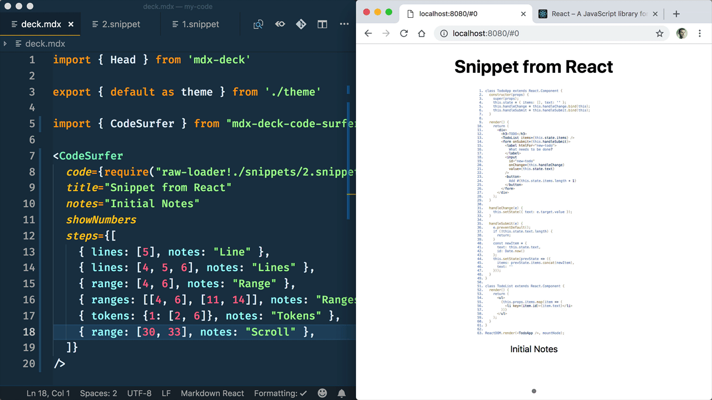
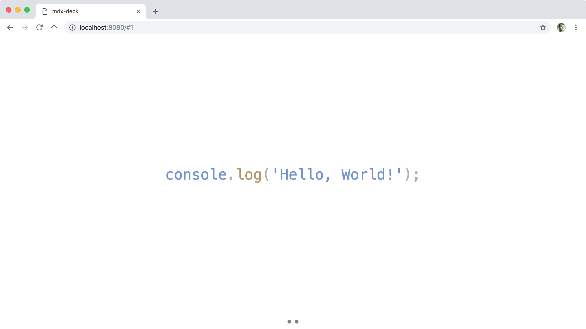
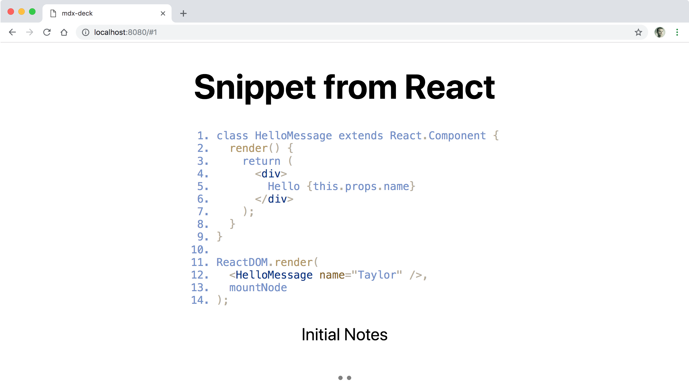
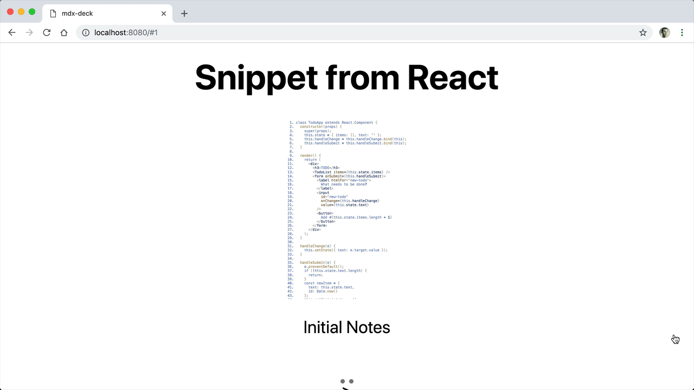

A new React [`<CodeSurfer />`](https://github.com/pomber/code-surfer) Component was release by Rodrigo Pombo ([@pomber](https://twitter.com/pomber)) making it easy to hightlight, scroll, and zoom code snippets in a [mdx-deck](https://github.com/jxnblk/mdx-deck) slide presentation. mdx-deck is a great project, written by Brent Jackson ([@jxnblk](https://twitter.com/pomber)), that allows you to create a MDX-based (Markdown and JSX) slide presentations.

<!--more-->

## Free Egghead.io Video

The following 5 minute video is a quick introduction to the `<CodeSurfer />` React component. The rest of this blog post covers the contents of the video via text, code snippets, and images.



## Create a Basic `mdx-deck` Presentation

If you have `npm` version `6.1.0` or above, then you can easily get started with `mdx-deck` using the following zero-configuration terminal command...

```shell
npm init deck my-code
```

Otherwise, if you have a version of `npm` older than `6.1.0`, then you can do something like the following...

```shell
mkdir my-code && cd $_ # create folder & cd into it
npm init -y # create package.json using default values
npm i mdx-deck -D # install mdx-deck as devDependency
echo "# Hello\n---\n# Goodbye" > deck.mdx # create basic deck
npx mdx-deck deck.mdx # run local mdx-deck server
```

## Install `<CodeSurfer />`

Once you have a basic `mdx-presentation` created ([previous step](create-a-basic-mdx-deck-presentation)), you can go ahead and actually install the package that this post is all about, which is `mdx-deck-code-surfer`. To do that, run the following line in your terminal...

```shell
npm install mdx-deck-code-surfer -D
```

## Simple Hardcoded Usage of `<CodeSurfer />`

Inside your `deck.mdx` file, you can create a new slide using `---` (which represents a `<hr />` in markdown). The following snippet has a first slide of `# Hello` as an example.

Once you have a new slide, add an import for `CodeSurfer` and then you can start using the component immediatley. Here we are supplying the `code` prop and providing a static code snippet of `console.log('Hello, World!');`;

```javascript
# Hello

This is the first slide

---

import { CodeSurfer } from "mdx-deck-code-surfer";

<CodeSurfer
  code="console.log('Hello, World!');"
/>
```



> **NOTE:** By default the `lang` prop is set to `javascript`, but you can override that
> with values from [`prism-react-renderer`](https://github.com/FormidableLabs/prism-react-renderer/blob/master/src/vendor/prism/includeLangs.js)

## Import a Code Snippet from Disk with Basic Props

Instead of inlining multiple lines of code directly into the `code` prop, you
could instead require the snippet from a file. To do this, we'll use the webpack
`raw-loader` dependency. You can install it as a devDependency useing the
following command...

```shell
npm install raw-loader -D
```

> **NOTE:** I've take a snippet of code from the [React website](https://reactjs.org/tutorial/tutorial.html) and saved it to a
`/snippets/1.snippet` file.

Once you have a local snippet file, you can replace the hard-coded string int he
`code` prop to `require` your snippet. You'll want to use the webpack `raw-loader!` and then navigate to your local snippet file (see below example).

```javascript
<CodeSurfer
  code={require("raw-loader!./snippets/1.snippet")}
  title="Snippet from React"
  notes="Initial Notes"
  showNumbers
/>
```



----

## Interactive Steps: Lines, Range, Ranges, and Tokens

The main power behind `<CodeSurfer />` is the use of the `steps` prop, which
allows you to control which lines should be spotlighted. This
is handy when there is a lot of code and you'd like the viewer to hone-in on one
or more lines.

The following examples shows of the following props...

* `lines`: spotlights one or more unique lines of code
* `range`: spotlights a range of lines grouped together
* `ranges`: spotlights multiple ranges at one time
* `tokens`: spotlights individual tokesn within a line or lines

> **NOTE:** I've take a longer snippet of code from the [React website](https://reactjs.org/tutorial/tutorial.html) and saved it to a
`/snippets/2.snippet` file.

```javascript
<CodeSurfer
  code={require("raw-loader!./snippets/2.snippet")}
  title="Snippet from React"
  notes="Initial Notes"
  showNumbers
  steps={[
    { lines: [ 5 ], notes: "Line" },
    { lines: [ 2, 5, 6 ], notes: "Lines" },
    { range: [ 4, 6 ], notes: "Range" },
    { ranges: [ [ 4, 6 ], [ 11, 14 ] ], notes: "Ranges" },
    { tokens: { 1: [ 2, 6 ] }, notes: "Tokens" },
    { range: [ 30, 33 ], notes: "Scroll" }
  ]}
/>

> **NOTE:** If the line(s) in question are off screen, `<CodeSurfer />` will
> auto-scroll the snippet (if it was too long) in order to present the
> spotlighted code to the viewer.
```



## Conclusion

If you have a presentation coming up or you just need to present some documentation, then the `<CodeSurfer />` React component is a powerful way to highlight, zoom, and scroll snippets of code. Also, if you haven't tried `mdx-deck`, then I highly encourage you to give it a go.

