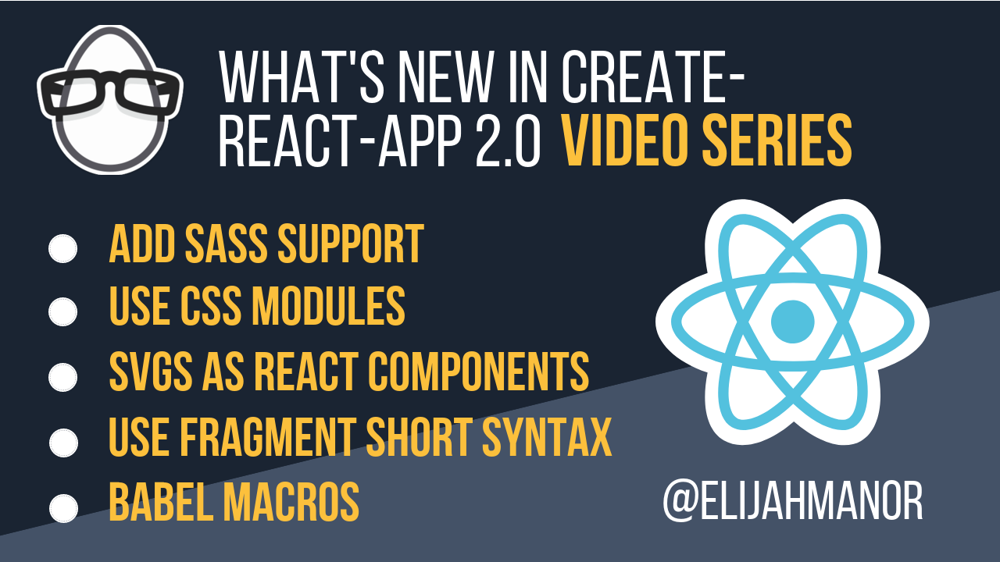
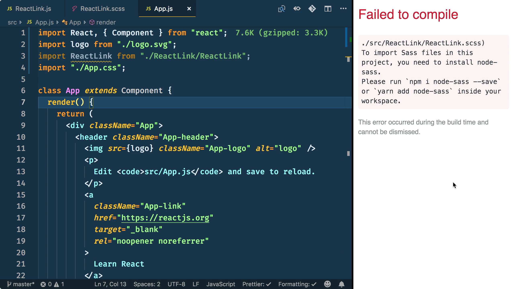

Earlier this month [Create React App 2.0](https://reactjs.org/blog/2018/10/01/create-react-app-v2.html) was released adding a lot of new features. Some of those features include Sass Support, CSS Modules Support, Adding SVGs as React Components, Fragment Short Syntax, and Babel Macros. In this post, I'll be highlighting the above 5 features. For a complete list of all the features of Create React App 2.0 please check out the official post on the [React Blog](https://reactjs.org/blog/2018/10/01/create-react-app-v2.html).

<!--more-->

## Adding Sass Support



Previously Create React App 1.x did not support any CSS preprocessor out-of-the box, such as [Sass](https://sass-lang.com/), LESS, Stylus, or PostCSS.

Therefore, developers were left to either…

1. Use native CSS
2. Manually run a CSS preprocessor outside the normal CRA build flow
3. Eject their project with `npm run eject` and add webpack support for a CSS preprocessor
4. Use [`react-app-rewired`](https://github.com/timarney/react-app-rewired) to get around ejecting CRA
5. Use a CSS-in-JS solution such as [emotion](https://github.com/emotion-js/emotion), etc…

However, with Create React App 2.0 you can now use Sass, although it doesn't come out-of-the box exactly. Once you do import a Sass file, then CRA will display a detailed error message guiding you to install …

One of the new features is support for [Sass](https://sass-lang.com/). If you start to use Sass, create-react-app will give you an error, but will display the following detailed error on how you can add Sass support to your project.

At that point, you can `npm i node-sass --save` and restart your dev server for Sass support!

You can watch a free [2:30 minute Egghead.io video](https://egghead.io/lessons/react-add-sass-support-to-create-react-app-2-0) of me demonstrating this feature.

## CSS Modules Support



As I mentioned above, other than native CSS support, Create React App 1.x didn't support many other styling options out-of-the-box. Another popular styling technique that mirrors the idea of React Components is called CSS Modules.

CSS Modules is a very powerful technique because it automatically scopes class names and animation names in a local way in order to get around the problem of global class name clashes. You can learn more by looking at the [CSS Modules repository](https://github.com/css-modules/css-modules).

With CSS Modules you do not have to install any other dependencies like is necessary with Sass Support. In order to opt-in to CSS Modules, you need to follow the naming convention of `*.module.css`. The following file is named `Link.module.css` and defines the classes `.default`, `.warning`, and `.error`. You may notice a couple of things that are unique to this file...

1. The class names are very terse and specific to the file. Since the class names are local there is no need to follow a rigid naming formation like BEM, for example.
2. Much like you compose Components in React, you can also use composes in CSS Modules to build up styles. The following `.warning` class takes the styles from `.default` and adds it's own styles to it `color` and `background-color`.

Once you import the CSS Module, you save off the default export for use inside your React Component. For example, mode could have values of `default`, `warning`, and `error` that match the class names from the `Link.module.css` imported file. 

> NOTE: The reason these classes are considered local is because dynamic class names are generated for them. If you were to look at your browser's DevTools you'd see class names that semi-resemble the name you called them. 

You can watch a free [2:57 minute Egghead.io video](https://egghead.io/lessons/react-use-css-modules-with-create-react-app-2-0) of me demonstrating this feature.

## Adding SVGs as React Components



Previously in Create React App 1.x when you wanted to import a SVG you would be grabbing the filename and using that as the source of an image. This was a workable solution, but now with Create React App 2.0 you can also optionally render a Component version of the SVG.

You might be wondering why this is such a big deal. Well, the Component version of the SVG renders as an inline SVG, which opens up the possibility of styling the various parts of the SVG.

So, for example, in the following CSS snippet I dive into the `.App-logo` and style the g element to be salmon in color. And then, I go one step further to animate the path's stroke!

> NOTE: The following snippet only show the extra bit of CSS I added to style the nested elements of the SVG. In case you were wondering, I omitted the styles that rotate the logo.

You can watch a free [2:26 minute Egghead.io video](https://egghead.io/lessons/react-add-svgs-as-react-components-with-create-react-app-2-0) of me demonstrating this feature.

## Use the Fragment Short Syntax



One of the new underlying features of Create React App 2.0 is upgrading to Babel Version 7, which enables the Short Syntax of React Fragments. You might be thinking, "Wait, weren't Fragments added back in React 16.2?". If that is what you were thinking, you'd be completely right! However, the Short Syntax of Fragment has only been available since Babel 7.0. As a refresher, Fragments let you wrap a group of React children without adding an extra parent node to the DOM, which is helpful if you need to maintain a specific DOM structure.
So, in the following code snippet, instead of using `<React.Fragment></React.Fragment>` or `<Fragment></Fragment>`, since Create React App 2.0 uses Babel 7.0+, you can leverage the Fragment Short Syntax of `<></>` instead. Yes, it looks kind of strange to begin with, but I've started to get used to it.

You can watch a free [2:56 minute Egghead.io video](https://egghead.io/lessons/react-use-the-fragment-short-syntax-in-create-react-app-2-0) of me demonstrating this feature.

## Babel Macros Support



I don't yet have a lesson covering [Babel Macros](https://babeljs.io/blog/2017/09/11/zero-config-with-babel-macros), but I have plans on covering this feature next in an upcoming [Egghead.io](https://egghead.io) video. In the meantime, feel free to watch the above video by [Kent C. Dodds](https://twitter.com/kentcdodds) showing Babel Macros in-action along with a beta version of Create React App 2.0.

Since Create React App doesn't let you change it's configuration (unless you eject or use [react-app-rewired](https://github.com/timarney/react-app-rewired)), the addition of Babel Macros to Create React App 2.0 was a welcome feature that opens up the ability to tap into Babel code transformations without tweaking babel's configuration.

Until I have a video covering this topic, feel free to watch the above video, check out the [official repository documentation](https://www.npmjs.com/package/babel-plugin-macros), and read a detailed blog post by the creator of the library entitled [How writing custom Babel & ESLint plugins can increase productivity & improve user experience](https://blog.kentcdodds.com/how-writing-custom-babel-and-eslint-plugins-can-increase-your-productivity-and-improve-user-fd6dd8076e26).

## Conclusion

There's so much more to the Create React App 2.0 release than just the items above. For more features, I encourage you to check out the official post on the [React Blog](https://reactjs.org/blog/2018/10/01/create-react-app-v2.html).
