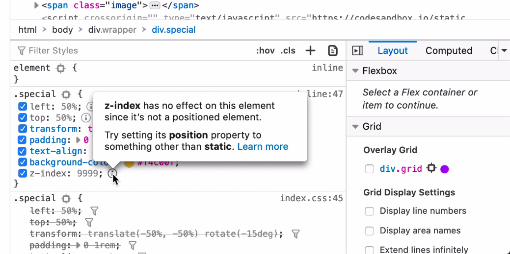



Have you ever found yourself at a loss in your browser's DevTools trying to figure out why a certain CSS declaration does not seem to work appropriately? You are not alone! Also, DevTools are getting much better too.

## Firefox DevTools

As of Firefox 70, there is an awesome new feature called [Inactive CSS](https://hacks.mozilla.org/2019/10/firefox-70-a-bountiful-release-for-all/#developertools) that will gray out CSS declarations that have no effect, provide tips on what is wrong, suggest ways to fix it, and provide a helpful link for more information.

<!--more-->

## Play Around

You can watch the video above to see various scenarios where the new feature can be handy. Feel free to open up Firefox and play around with the [sample website](https://codesandbox.io/s/firefox-css-inactive-example-1k2rc?file=/index.css) that I use in the video.

## Conclusion

I'm so excited about these investments in DevTools. I think this will help many developers better understand CSS. I look forward to additional changes in our tooling to help teach us while we are building.
