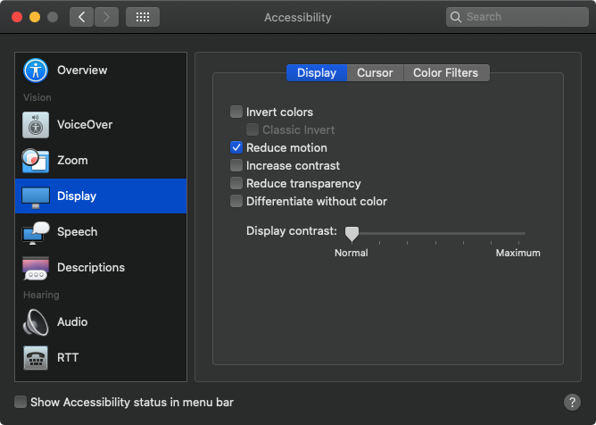



In this post we focus on toggling animations on and off using the [`prefers-reduced-motion`](https://developer.mozilla.org/en-US/docs/Web/CSS/@media/prefers-reduced-motion) media query. We will take a look at addressing 3 types of animations (CSS, SVG SMIL, and JavaScript) and we will toggle these animations using different techniques such as @media, matchMedia, and a custom React hook.

> NOTE: You can find the [code for this project](https://github.com/elijahmanor/egghead-prefers-reduced-motion/tree/final) in GitHub.

<!--more-->

## Operating System setting for Reduce Motion



Many operating systems have a Reduce Motion feature in their Accessibility settings. As of now, our web app does not respect this setting, but we will update our app to do so.

## CSS Solution

Thankfully there is a media query called `prefers-reduced-motion` that we can detect via CSS. Using the [`@media`](https://developer.mozilla.org/en-US/docs/Web/CSS/@media) CSS [at-rule](https://developer.mozilla.org/en-US/docs/Web/CSS/At-rule), we can adjust some animation declarations based on the `prefers-reduced-motion` media query. Acceptable values for this query are `no-preference` and `reduce`.

The following CSS detects for a reduced motion experience and adjusts the `.App-logo` and `.Logo-orbit` selectors to turn off their CSS animations. With this small bit of code, your app can dynamically toggle animations as the user adjusts their Operating System Reduce Motion setting.

```css
@media (prefers-reduced-motion: reduce) {
  .App-logo,
  .Logo-orbit {
    animation: none;
  }
}
```

> NOTE: For a bigger picture of the codebase reference the video above or check out the GitHub link above.

## SVG SMIL Solution

We could follow suite and use CSS to adjust a SVG SMIL animation, but we can't exactly pause the animation. The best we could do is hide the animation by making the elements `display: none`, however that does not seem like the best solution.

```css
@media (prefers-reduced-motion: reduce) {
  .Logo-electron {
    display: none;
  }
}
```

So, let's use another technique. We will shift to using JavaScript instead. We can use the matchMedia API via JavaScript to match the same media query from our CSS. The following uses React Hooks to setup `matchMedia` and wires up an event handler to adjust to any changes that may occur.

```javascript
const [
  shouldReduceMotion,
  setShouldReduceMotion
] = React.useState(false)
React.useEffect(() => {
  const mediaQuery = window.matchMedia(
    '(prefers-reduced-motion: reduce)'
  )
  setShouldReduceMotion(mediaQuery.matches)
  const handleMedia = e =>
    setShouldReduceMotion(e.matches)
  mediaQuery.addEventListener('change', handleMedia)
  return () =>
    mediaQuery.removeEventListener(
      'change',
      handleMedia
    )
}, [])
```

The above code sets up the `shouldReduceMotion` to reflect the current state of the Operating System's Reduce Motion setting, but now we need to actually use it. Here we create a React ref, attach it to the SVG logo, and call either `pauseAnimations` off of the SVG DOM element or `unpauseAnimations` depending on the state of `shouldReduceMotion`.

```js
const logoRef = React.useRef()
React.useLayoutEffect(() => {
  shouldReduceMotion
    ? logoRef.current.pauseAnimations()
    : logoRef.current.unpauseAnimations()
}, [shouldReduceMotion])
```

## JavaScript Solution

Lastly, we'll focus on removing the animation from the bar charts, which are animated via JavaScript. The code uses `framer-motion` for the animation and each element has a `animate` prop that we can dynamically set.

Since we already have defined `shouldReduceMotion`, we can leverage that state and update the animate prop to either be `undefined` or `true` based on it's value.

```jsx
<AnimateSharedLayout>
  <motion.ul className="Votes">
    {votes.map(vote => (
      <motion.li
        animate={shouldReduceMotion ? undefined : true}
        { /* ... more ... */ }
      >
        <motion.div
          animate={
            shouldReduceMotion ? undefined : true
          }
        >
          {vote.percentage}%
        </motion.div>
      </motion.li>
    ))}
  </motion.ul>
</AnimateSharedLayout>
```

Before we finish, let's utilize a custom hook that framer-motion provides called `usedReducedMotion`. This essentially does all the stuff that we manually wrote earlier... so we can delete much of our code... and replace it with `shouldReduceMotion` equals useReducedMotion.

```js
import {
  transform,
  motion,
  AnimateSharedLayout,
  useReducedMotion
} from 'framer-motion'

const shouldReduceMotion = useReducedMotion()
/* ... delete all the previous
   useState/useEffect code that
   involved matchMedia ... */
```

## Conclusion

I hope that this helped show different ways that you can manage turning on and off animations depending on the Operating System's Reduce Motion setting. Please be kind to your users. Some may not like animations and others may have medical issues concerning animations.
