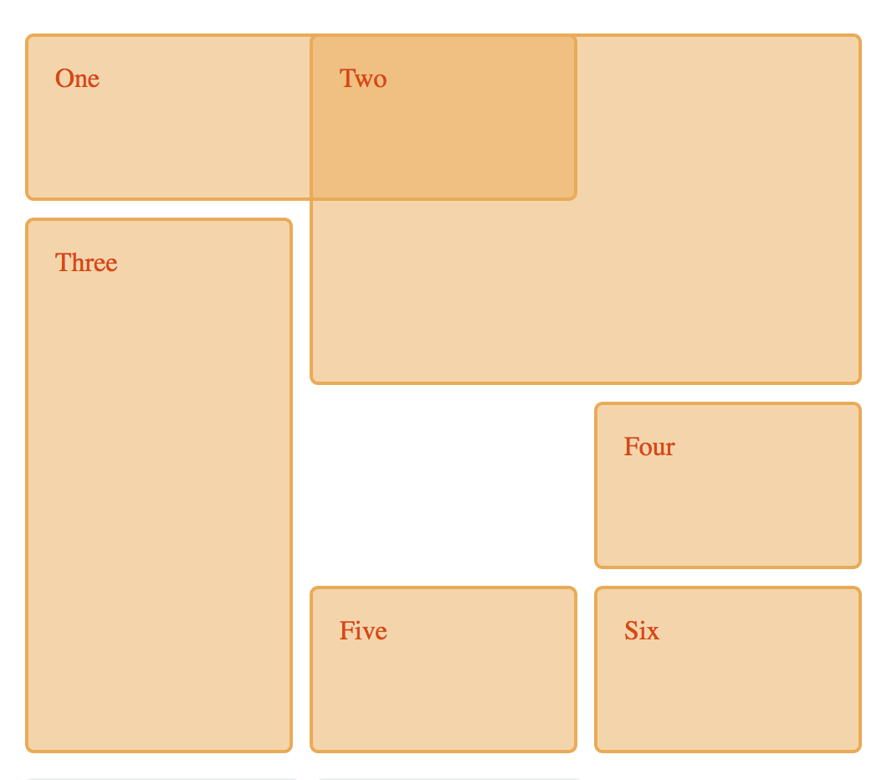
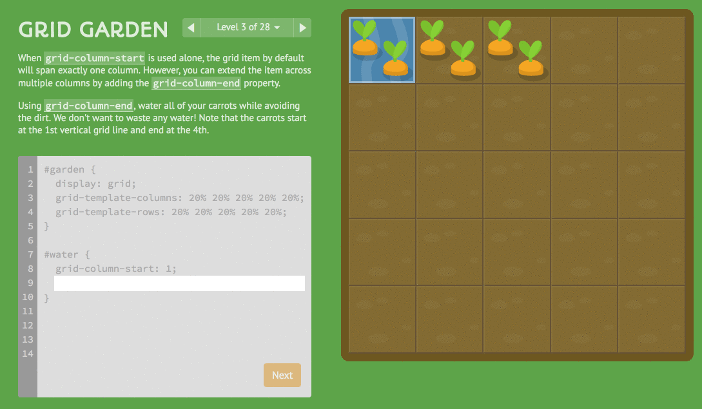

# Alignment

> "Center Me... If You Can" --[Me](http://twitter.com/elijahmanor)

------

<!-- .slide: data-title="Alignment" data-state="backEndBrian juniorJacob Slide--up extended" data-menu-title="Learning the Hard Way" -->

  <a href="http://www.commitstrip.com/en/2015/05/21/learning-the-hard-way/">Learning the hard way</a> / <a href="http://twitter.com/commitstrip">@CommitStrip</a>

------

<!-- .slide: data-title="Alignment" data-state="backEndBrian juniorJacob Slide--up" data-menu-title="One Does Not Simply Center" -->

<!--
## Scenario

> TODO: start using float... and cry

have code example here trying to lay something out with flout

## Floats

TODO: briefly talk about floats

* https://css-tricks.com/all-about-floats/
* http://nicolasgallagher.com/micro-clearfix-hack/

## Clearing Floats

TODO: Show the various ways to clear floats. This could be several slides with midLEvelMelissa coming in near the end

## Floating Frustrations

TODO: Talk about some of the limitations of using floats all the time

Show example (hopefully it is a real one and not just my ignorance)

Thinking about example using floats for layout (grid system), but then trying to align things inside one of those cells. ran into this with EveryDollar... want to replicate on reduced level
-->

------

## Alignment in CSS is a Pain
<!-- .slide: data-title="Alignment" data-state="backEndBrian juniorJacob" -->

  

    <h3 class="fragment">Horizontal</h3>
    

      <pre data-codemirror data-mode="text/css" data-line-numbers="false" data-lines="">
.kids { text-align: center; }</pre>
    

    

      <pre data-codemirror data-mode="text/css" data-line-numbers="false" data-lines="">
.me { margin: 0 auto; }</pre>
    

    

      <pre data-codemirror data-mode="text/css" data-line-numbers="false" data-lines="">
.mum { position: relative; }
.kid {
  position: absolute;
  height: 100px;
  width: 100px;
  margin: 0px 0 0 -50px;
  left: 50%;
}</pre>
    

  

  

    <h3 class="fragment">Vertical</h3>
    

      <pre data-codemirror data-mode="text/css" data-line-numbers="false" data-lines="">
.mid-text {
  height: 100px;
  line-height: 100px;
}</pre>
    

    

      <pre data-codemirror data-mode="text/css" data-line-numbers="false" data-lines="">
.mum { position: relative; }
.kid {
  position: absolute;
  top: 50%;
  transform: translateY(-50%);
}</pre>
    

  

------

### Centering in CSS: A Complete Guide
<!-- .slide: data-title="Alignment" data-state="backEndBrian juniorJacob" -->

<!-- <iframe style="background-color: white;" class="stretch" src="https://css-tricks.com/centering-css-complete-guide/" /> -->

<a href="https://css-tricks.com/centering-css-complete-guide/" data-preview-link>Preview</a>

------

## Media Object
<!-- .slide: data-title="Alignment" data-state="backEndBrian juniorJacob extended" data-menu-title="Media Object: Markup" -->

<pre data-codemirror data-mode="text/html" data-line-numbers="false" data-lines="">

  
  

    <h3 class="mediaTitle">Title</h3>
    
Yada yada yada

  

</pre>

------

## Media Object
<!-- .slide: data-title="Alignment" data-state="backEndBrian juniorJacob extended" data-menu-title="Media Object: Float CSS" -->

Float Version

  

    <pre data-codemirror data-mode="text/css" data-line-numbers="false">
.media {
  margin-bottom: 1em;
}

.mediaFigure {
  float: left;
  margin-left: 0;
  margin-right: 1em;
}

.media, .mediaBody {
  overflow: hidden;
}</pre>
  

  

    <textarea data-codemirror data-mode="text/css" data-line-numbers="false">
.mediaBody,
.mediaBody :last-child {
  margin-bottom: 0;
}

.mediaTitle {
  margin: 0 0 .5em;
}

.mediaReverse > .mediaFigure {
  float: right;
  margin: 0 0 0 1em;
}</textarea>
  

------

## So What!?!
<!-- .slide: data-title="Alignment" data-state="backEndBrian juniorJacob" -->

------

## Flex-box
<!-- .slide: data-title="Alignment" data-state="backEndBrian juniorJacob midLevelMelissa" -->

  

    

  

  

    <blockquote class="twitter-tweet" data-lang="en">
Globally, 92% of browsers in use support border-radius. 96% support Flexbox. Still think it’s too early to use Flexbox?
&mdash; Jen Simmons (@jensimmons) <a href="https://twitter.com/jensimmons/status/702624258145579008">February 24, 2016</a></blockquote>
  

------

## Flex-box Cheatsheet
<!-- .slide: data-title="Alignment" data-state="backEndBrian juniorJacob midLevelMelissa" -->

<!-- <iframe style="background-color: white;" class="stretch" src="https://css-tricks.com/snippets/css/a-guide-to-flexbox/" /> -->

<a href="https://css-tricks.com/snippets/css/a-guide-to-flexbox/" data-preview-link>Preview</a>

------

<!-- .slide: data-title="Alignment" data-state="backEndBrian juniorJacob midLevelMelissa extended" data-menu-title="Flexbox Playground" -->

<h1><a href="http://the-echoplex.net/flexyboxes" data-preview-link>
☟☟☟☟

☞ Flexbox ☜

☞ Playground ☜

☝☝☝☝☝☝</a></h1>

<!--<iframe src="http://the-echoplex.net/flexyboxes" class="stretch" />-->

------

## [FlexboxIn5.com](http://flexboxin5.com/)
<!-- .slide: data-title="Alignment" data-state="backEndBrian juniorJacob midLevelMelissa" -->

------

## [FlexboxFroggy.com](http://flexboxfroggy.com/)
<!-- .slide: data-title="Alignment" data-state="backEndBrian juniorJacob midLevelMelissa" -->

Guide Froggy and friends to the lilypads!

<!-- 

  

 -->

------

## [FlexboxDefense.com](http://www.flexboxdefense.com/)
<!-- .slide: data-title="Alignment" data-state="backEndBrian juniorJacob midLevelMelissa" -->

Stop the incoming enemies from getting past your defenses!

------

## Media Object
<!-- .slide: data-title="Alignment" data-state="backEndBrian juniorJacob midLevelMelissa extended" data-menu-title="Media Object: Flexbox CSS" -->

Flexbox Version

  

    <pre data-codemirror data-mode="text/css" data-line-numbers="false">
.media {
  display: flex;
  align-items: flex-start;
  margin-bottom: 1em;
}

.mediaFigure {
  margin-left: 0;
  margin-right: 1em;
}

.mediaCenter {
  align-items: center;
}</pre>
  

  

    <textarea data-codemirror data-mode="text/css" data-line-numbers="false">
.mediaBody,
.mediaBody :last-child {
  margin-bottom: 0;
}

.mediaTitle {
  margin: 0 0 .5em;
}

.mediaReverse > .mediaFigure {
  order: 1;
  margin: 0 0 0 1em;
}</textarea>
  

------

## CSS Grid
<!-- .slide: data-title="Alignment" data-state="backEndBrian juniorJacob midLevelMelissa" data-menu-title="Media Object: Flexbox CSS" -->

  

    

  

  

    <blockquote class="twitter-tweet" data-lang="en">
Want to learn about CSS Grid? I made a list of the best resources: <a href="https://t.co/epIs2yFL76">https://t.co/epIs2yFL76</a>
&mdash; Jen Simmons (@jensimmons) <a href="https://twitter.com/jensimmons/status/836336727878950912">February 27, 2017</a></blockquote>
  

------

## CSS Grid Example
<!-- .slide: data-title="Alignment" data-state="backEndBrian juniorJacob midLevelMelissa" data-menu-title="Media Object: Flexbox CSS" -->

  

    <textarea data-codemirror data-mode="text/html" data-line-numbers="false">

  
1

  
2

  
3

  
4

  
5

  
6

</textarea>
    <small>Source: <a href="https://developer.mozilla.org/en-US/docs/Web/CSS/CSS_Grid_Layout">MDN: CSS Grid Layout</a></small>
  

  

    <textarea data-codemirror data-mode="text/css" data-line-numbers="false">
.wrapper {
  display: grid;
  grid-template-columns:
    repeat(3, 1fr);
  grid-gap: 10px;
  grid-auto-rows:
    minmax(100px, auto);
}
.one {
  grid-column: 1 / 3;
  grid-row: 1;
}
.two { 
  grid-column: 2 / 4;
  grid-row: 1 / 3;
}
.three {
  grid-row: 2 / 5;
  grid-column: 1;
}
.four {
  grid-column: 3;
  grid-row: 3;
}
.five {
  grid-column: 2;
  grid-row: 4;
}
.six {
  grid-column: 3;
  grid-row: 4;
}
</textarea>
  

  

------

## [CSSGridGarden.com](https://cssgridgarden.com/)
<!-- .slide: data-title="Alignment" data-state="backEndBrian juniorJacob midLevelMelissa" data-menu-title="Media Object: Flexbox CSS" -->

------

## Awesome Firefox Dev Tools
<!-- .slide: data-title="Alignment" data-state="backEndBrian juniorJacob midLevelMelissa" data-menu-title="Media Object: Flexbox CSS" -->

------

## Do I use Flexbox or Grids?!?!
<!-- .slide: data-title="Alignment" data-state="backEndBrian juniorJacob midLevelMelissa" data-menu-title="Media Object: Flexbox CSS" -->

------

## Do I use Flexbox for Grids?
<!-- .slide: data-title="Alignment" data-state="backEndBrian juniorJacob midLevelMelissa" data-menu-title="Media Object: Flexbox CSS" -->

> Flexbox is for one-dimensional layouts - anything that needs to be laid out in a straight line (or in a broken line... 
> Grid is for two-dimensional layouts. It can be used as a low-powered flexbox substitute... but that’s not using its full power. --[Tab Atkins](http://lists.w3.org/Archives/Public/www-style/2013May/0114.html) 

------

## Resources
<!-- .slide: data-title="Alignment" data-state="backEndBrian juniorJacob midLevelMelissa resources" -->

* [Centering in CSS: A Complete Guide](https://css-tricks.com/centering-css-complete-guide/)
* [A Complete Guide to Flexbox](https://css-tricks.com/snippets/css/a-guide-to-flexbox/)
* [What the Flexbox?](http://flexbox.io) - Free 20 video course
* [Flexbox In 5](http://flexboxin5.com/)
* [Flexbox Froggy](http://flexboxfroggy.com/)
* [Flexbox Defense](http://www.flexboxdefense.com/)
* [Solved by Flexbox](http://philipwalton.github.io/solved-by-flexbox/)
* [Flexplorer](http://bennettfeely.com/flexplorer/)
* [Flexy Boxes](http://the-echoplex.net/flexyboxes/)
* [Grid By Example](http://gridbyexample.com/) by [Rachel Andrew](https://twitter.com/rachelandrew)

Notes:

* [A Visual Guide to CSS3 Flexbox Properties](https://scotch.io/tutorials/a-visual-guide-to-css3-flexbox-properties)
* [Flexbox Cheatsheet](http://jonibologna.com/flexbox-cheatsheet/)
* http://codepen.io/elijahmanor/pen/MYxRMr?editors=110
* http://philipwalton.github.io/solved-by-flexbox/
* http://www.sitepoint.com/solving-layout-problems-css-table-property/
* http://www.flexboxdefense.com/
* http://tympanus.net/codrops/css_reference/flexbox/
* https://blog.codepen.io/2015/04/12/flexbox-fridays-by-lincoln-loop/

* https://css-tricks.com/using-flexbox/
* http://www.sitepoint.com/are-we-ready-to-use-flexbox/
* https://css-tricks.com/forums/topic/flexbox-with-fallback/
* http://designkarma.co.uk/blog/using-flexbox-now
* http://www.planningforaliens.com/blog/2014/03/11/real-world-flexbox/
