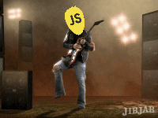

# How to Pick Good JavaScript Libraries
### by [@elijahmanor](http://twitter.com/elijahmanor)

Notes: The ideas covered address either a specific focused library (micro-library) or a large framework with lots of bells and whistles. My intent isn't to say "You should use XYZ library", however, it is to describe the things I look for when picking a library (whether large or small) for a project.

Once a library is integrated into your project you create a dependency on it and if it doesn't meet many of the above criteria, then it could end up being a painful relationship in the future. I find myself regularly using a set of rules to "assess" a project before using it.

I also want to discuss the risks if a library doesn't meet one or more of these criteria. For example, if the project hasn't been maintained for a while or if there is only one main contributor, then you as a consumer may need to accept the risk of taking over the project or fixing bugs as they arise in your application. I've seen too many projects where the creator changes passions or gets to busy with other projects. 

 <!-- .element: class="gif" -->
 <!-- .element: class="gif" -->
 <!-- .element: class="gif" -->
 <!-- .element: class="gif" -->
 <!-- .element: class="gif" -->
 <!-- .element: class="gif" -->

---

## `me.json`

```
{
  "priorities" : [ "Christian", "Family", "Work" ],
  "work"       : [ "@DaveRamsey", "@PluralSight" ],
  "tech"       : [ "HTML", "CSS", "JavaScript" ],
  "titles"     : [ "MS RD", "MS MVP", "IE userAgent" ]
}
```

------

## It's A Green Mario!
### A.K.A. Luigi

 <!-- .element: style="height: 12em;" -->

---

# Mr. JavaScript

> "Hello, my name is Mr. JavaScript..."

 <!-- .element: class="gif" -->

---

# History
### How Did We Get To Where We Are?

------

## Solved Minor Front-End Concerns

 <!-- .element: class="gif" -->

------

## Unexpected Rise in Popularity

 <!-- .element: class="gif" -->

------

## In the Spotlight

 <!-- .element: class="gif" -->

------

## JavaScript Everywhere!

 <!-- .element: class="gif" -->

---

# Emotions 
### The Process We Go Through As Developers

------

## How You See Yourself Using a Library

 <!-- .element: class="gif" -->

------

## What You Look Like As You Learn

 <!-- .element: class="gif" -->

------

## What Sometimes Happens in the End

 <!-- .element: class="gif" -->

------

## Put Up Your Defences

 <!-- .element: class="gif" -->

---

# JavaScript Overload
## Too Many Choices!

 <!-- .element: class="gif" -->

------

## GooglePlex Plus One

<pre class="fragment" data-trim><code>$ bower search 'angular' | grep -c 'angular'
2652
</code></pre>

<pre class="fragment" data-trim><code>$ npm search 'angular' | grep -c 'angular'
1212
</code></pre>

---

# JavaScript Criteria Assessment (JCA)

1. Active <!-- .element: class="fragment" -->
2. Documentation <!-- .element: class="fragment" -->
3. Community <!-- .element: class="fragment" -->
4. Credible <!-- .element: class="fragment" -->
5. Extensible <!-- .element: class="fragment" -->
6. Integration <!-- .element: class="fragment" -->
7. Modular  <!-- .element: class="fragment" -->
8. Quality <!-- .element: class="fragment" -->
9. Tests <!-- .element: class="fragment" -->

------

## The 9 Lives of JavaScript
### JavaScript Criteria Assessment

Active, Documentation, Community, Credible, Extensible, Integration, Modular, Quality, Tests

 <!-- .element: class="gif" -->

---

# Active

------

## When was it last updated?

* This week <!-- .element: class="fragment" data-fragment-index="1" -->
* This month <!-- .element: class="fragment" data-fragment-index="2" -->
* This quarter <!-- .element: class="fragment" data-fragment-index="3" -->
* This year!?! <!-- .element: class="fragment" data-fragment-index="4" -->

 <!-- .element: class="gif fragment" data-fragment-index="4" -->

------

## Are Issues Being Addressed?

------

## Are Pull Requests being Considered?

---

# Documentation
<!-- .slide: data-background="" -->

------

## Initial Impresion 
### Do You Know What It Does?

 <!-- .element: class="gif fragment" -->

------

## Different Learning Styles

* High Level Abstract <!-- .element: class="fragment" -->
* Code Splunk <!-- .element: class="fragment" -->
* API Dive <!-- .element: class="fragment" -->
* Code Exmpales <!-- .element: class="fragment" -->
* Demo Apps <!-- .element: class="fragment" -->
* Unit Tests <!-- .element: class="fragment" -->
* Videos <!-- .element: class="fragment" -->

------

## Combat Stale Docs
### Autogenerate

* [JSDoc](http://usejsdoc.org/)
* [SassDoc](http://sassdoc.com/)

---

# Community

------

## Are Developers Excited!?!

 <!-- .element: class="gif" -->

------

## GitHub

<span>Contributors</span> <!-- .element: class="fragment" -->
<span>, Commits</span> <!-- .element: class="fragment" -->
<span>, Favorites</span> <!-- .element: class="fragment" -->
<span>, Forks</span> <!-- .element: class="fragment" -->
<span>, Pull Requests (Open & Closed)</span> <!-- .element: class="fragment" -->

 <!-- .element: class="gif fragment" -->

------

## Stack Overflow
### In the trenches

* Are Quesitons Being Asked? <!-- .element: class="fragment" -->
* Are the Questions Being Answered? <!-- .element: class="fragment" -->
* Are the Questions/Answers Being Voted Up? <!-- .element: class="fragment" -->

------

## Soial Media
### Signs of Health

* Is there an Active Buzz on Twitter, Google Plus, etc...? <!-- .element: class="fragment" -->
* Are Developers Blogging about the Library? <!-- .element: class="fragment" -->

------

## Viva JavaScript

 <!-- .element: class="gif" -->

---

# Credible

------

## Trusted Author(s)

* Who authored the library? <!-- .element: class="fragment" -->
* What else have they created? <!-- .element: class="fragment" -->

------

## There Should Not Be Only One

 <!-- .element: class="gif" -->

------

## The Stop Sign Principle 

> What happens when the original author is out of the picture?

 <!-- .element: class="gif fragment" -->

------

## Good Example

* Angular: A Team of Developers Backed by Google

---

# Extensible

------

## Everything is Fine, Until I need to do `XYZ`

 <!-- .element: class="gif" -->

------

## Let Me Try This Hack, or This One, or...

 <!-- .element: class="gif" -->

---

# Integration

------

## I'll Just Integrate this JavaScript with my Application

 <!-- .element: class="gif" -->

------

## Punched in the Face by Incompatibility

 <!-- .element: class="gif" -->

---

# Quality

------

## You Open the Source Code

 <!-- .element: class="gif" -->

------

## Shed a Single JavaScript Tear

 <!-- .element: class="gif" -->

------

## There Has to Be a Better Way
### Static Analysis Tools

------

## HTML

* <!-- .element: class="fragment" --> [HTMLHint](http://htmlhint.com/)

------

## JavaScript

* <!-- .element: class="fragment" --> [JSLint/JSHint/ESLint](http://jshint.com)
* <!-- .element: class="fragment" --> [FixMyJS](https://github.com/jshint/fixmyjs) - Automatically fix silly lint errors (example: [http://fixmyjs.com](http://fixmyjs.com)) by [@ goatslacker](http://twitter.com/goatslacker) 
* <!-- .element: class="fragment" --> [Plato](https://github.com/es-analysis/plato) - Visualize JavaScript Complexity by [@jsoverson](http://twitter.com/jsoverson) (example: [jQuery](http://jsoverson.github.io/plato/examples/jquery/))
* <!-- .element: class="fragment" --> [JavaScript Compatibility Checker](http://jscc.info/) (jscc) by [@tbusser](http://twitter.com/tbusser)
* <!-- .element: class="fragment" --> [JSCritic](http://jscritic.com/) by [@kangax](http://twitter.com/kangax)
* <!-- .element: class="fragment" --> [JavaScript Code Style Checker](https://github.com/jscs-dev/node-jscs) (jscs) by [@jscs_dev](http://twitter.com/jscs_dev)
* <!-- .element: class="fragment" --> [JS Inspect](https://github.com/danielstjules/jsinspect) - Detect copy-pasted and structurally similar code by [@danielstjules](http://twitter.com/danielstjules)

------

## CSS

* <!-- .element: class="fragment" --> [CSSLint](http://csslint.net/) by [@slicknet](http://twitter.com/slicknet) & [@stubbornella](http://twitter.com/stubbornella)
* <!-- .element: class="fragment" --> [SCSS-Lint](https://github.com/causes/scss-lint)

---

# Tests

------

## Looks Like It'll Work, but Nope

 <!-- .element: class="gif" --> 

------

## The Library Is Barely Stable

 <!-- .element: class="gif" --> 

------

## In the End

 <!-- .element: class="gif" --> 

---

# Questions?

<pre style="font-size: 1.25em; box-shadow: none;">
<a href="http://elijahmanor.com]" class="fragment" style="margin-left: 3em;">http://elijahmanor.com</a>
<a href="http://twitter.com/elijahmanor" class="fragment" style="margin-left: 6.5em;">@elijahmanor</a>
<a href="http://bit.ly/good-js-libs" class="fragment" style="position: absolute; left: 3em;">http://bit.ly/good-js-libs</a>
</pre>

 <!-- .element: class="gif" -->

Notes: 

* http://www.johnpapa.net/javascript-soup/
* http://www.sencha.com/blog/4-questions-to-ask-before-choosing-a-javascript-framework/#date:14:56
